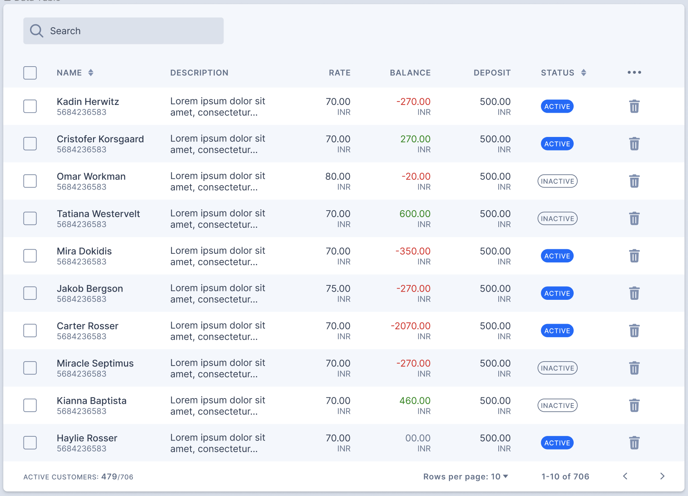

# Shell Agile Hub frontend interview!
Here we provide the instructions for developing a ReactJS application, to test the proficiency of applicants for the Frontend Developer.

## Prerequisites
* Knowledge of ReactJS, Typescript, HTML, CSS, styled-components (optional)
* Knowledge of installing npm packages (both local & global)
* Knowledge of creating React application using [Create React App](https://facebook.github.io/create-react-app/)
* Knowledge of dealing with JSON data
* A GitHub account in order to share the code with us

### Requirements:
- Table with all data to be displayed
- Negative balance should be red, positive green, 0 will be grey
- Sort by name (desc / asc)
- Sort by status (active / inactive)
- Search by name and description
- Remove with confirmation (Just native confirmation pop-up should be enough)
- Active customers counter (at the bottom)
- Navigation (next page , previous page)
- Rows per page (Select)

### Nice to have:
- Sorting combined (name, status)
- Unit tests

### Data:
- Find customers json at `src/data/customers.json`

### Figma
- Figma link: https://www.figma.com/file/R4u7VhyzowUnuNKJ96JPvz/Data-Table-(Community)?node-id=73%3A0

## Delivery
When you're done with the implementation create a PR against the `main` branch.

Your PR will now be reviewed.

## Available Scripts
In the project directory, you can run:

`yarn start`

Runs the app in the development mode.\
Open [http://localhost:3000](http://localhost:3000) to view it in the browser.

The page will reload if you make edits.\
You will also see any lint errors in the console.
